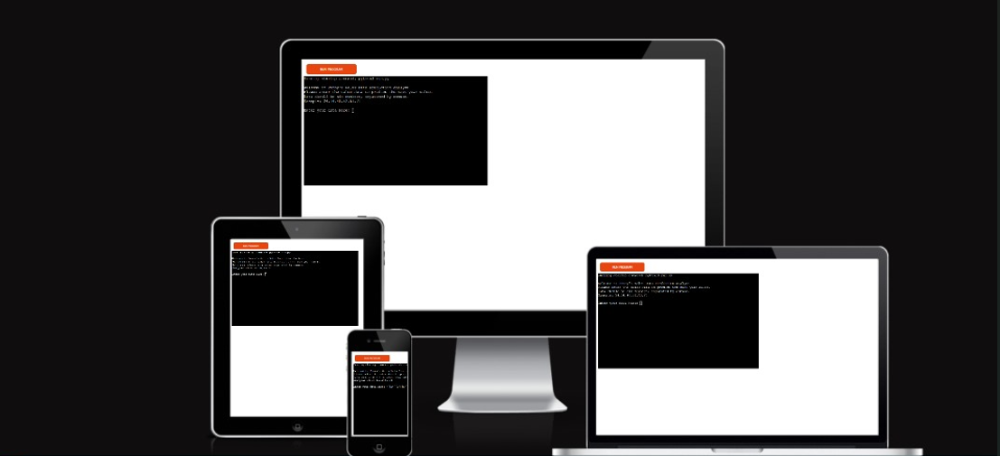

# PENNY'S SALES DATA PREDICTION PROGRAMMING
This Python program automates the process of predicting and managing yearly sales data for Penny's store. By integrating with Google Sheets, the program allows the user to input sales data for six different product categories and predict future sales based on a small random variance. The historical sales data for products like Jeans, Trousers, Shoes, Perfumes, Polo, and Knickers is tracked in a Google Sheets worksheet. The program updates this worksheet by adding new sales predictions, which are generated using historical data and random variations.
 Here is the link to Love Sandwish-heroku where employee details are entered [link](https://sales-prediction-f352ba78f145.herokuapp.com/)

  

  ## How to access Penny's Sales Data Prediction Programming:
- Enter the [link](https://sales-prediction-f352ba78f145.herokuapp.com/) alternatively you can also copy the link: `https://sales-prediction-f352ba78f145.herokuapp.com/` and paste it in the browser.
- Wait for the page to load and then you click 'RUN PROGRAM'.
- Choose from the options displayed.
1. Enter your sales Data
2. Automatically, the google sales worksheet for next year will be updated effectively statrting from the year 2020.
3. The program will ask you if you want to predict the sales for next year.
4. Press YES to continue with the sales prediction for next year.
5. press No to Exit the program.

## Users experience

#### To provide the perfect user experience and features for Penny's store statistics app, we need to focus on key elements like simplicity, user guidance, predictive insights, and visualization. Here's an enhanced version of your current app's user experience (UX) and feature set:
- As a user, a welcoming Introduction: When the app starts, give the user a clear overview of what they can do with the app (e.g., predict sales, view past statistics).
- Data Input Help: If the user enters incorrect data, provide specific, helpful error messages. Use color highlights to distinguish between errors and successful inputs (e.g., invalid input in red, successful in green).
- Error Handling for Incorrect Inputs: After a failed validation, guide the user on how to correct the input.
- Immediate Validation: After input, validate the data immediately and highlight success in green, errors in red.
- an error occures if not enough values or if non-numeric values are provided.
- How to exit the program once the valid details has been entered.

## Features

 **When the program is loaded**

- The user will be ushered in with a welcoming message.
- A statement which says you should enter the sales data to precict the next year sales is also displayed.
- An example of the kind and amount of data you should input is displayed 
- if the right combination is inputed a predictive data is generated for 2020, using random variance.
- The data is automatically updated on the google sheet
- The program will ask the users if they still want to predict sales for next year.
- if the user says YES, it automatically predict the next year input and if the user input a NO statement, it exit the program.

The user is expected to input the correct six digit numbers, seperated with commas in ther to predict the sales for next year.

**When the user Input the right combination**
- The sales for next year combination will be predicted, starting from the year 2020

**When the user enters invalid employee details**
- When the user enters details that is not equal to six, the user will see an error message and a provision to re-enter sales data to predict the next year sales.
- If the user also enteres an incorrect data, a helpful error messages use color highlights to distinguish between errors and successful input.
- After a failed validation, the code direct the users on how to correct the input.

